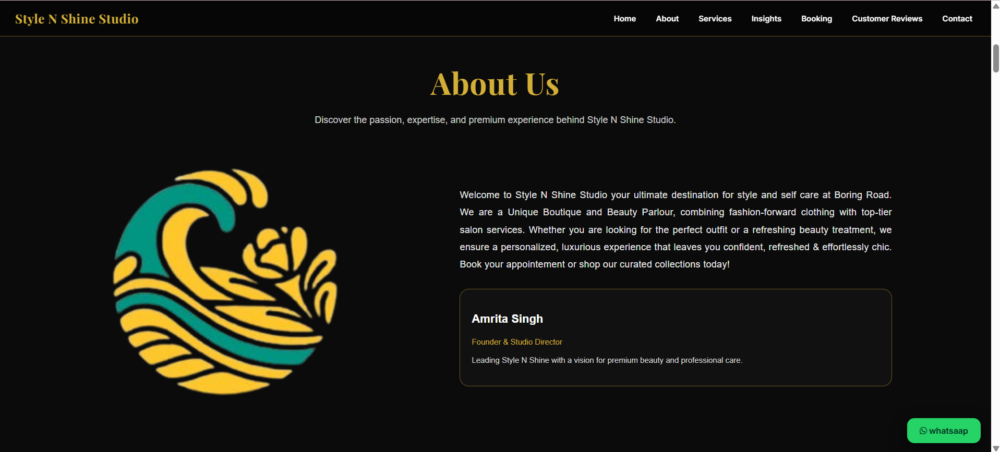
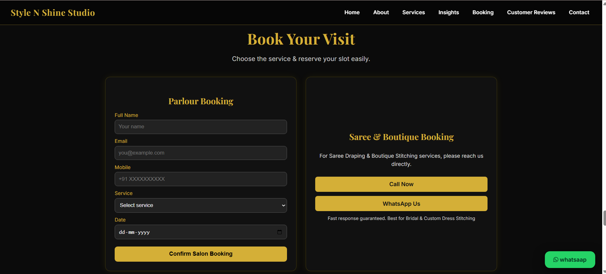
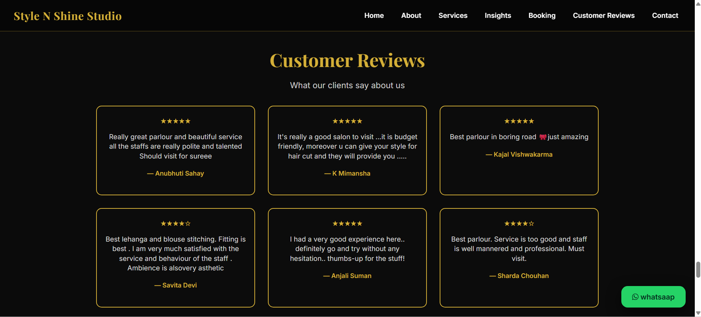
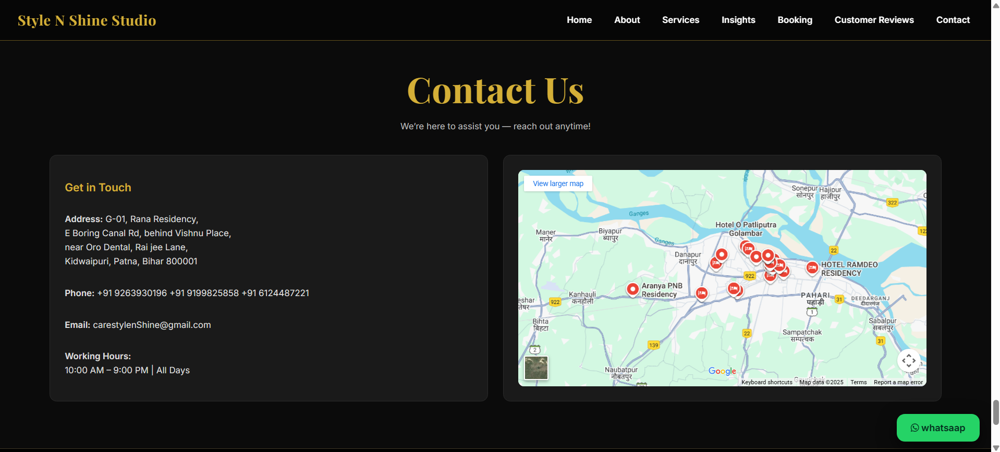
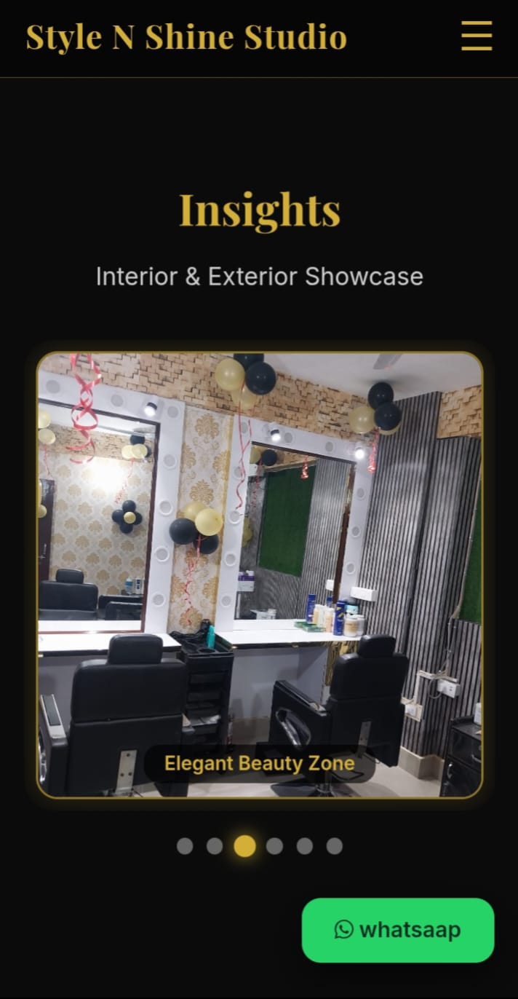
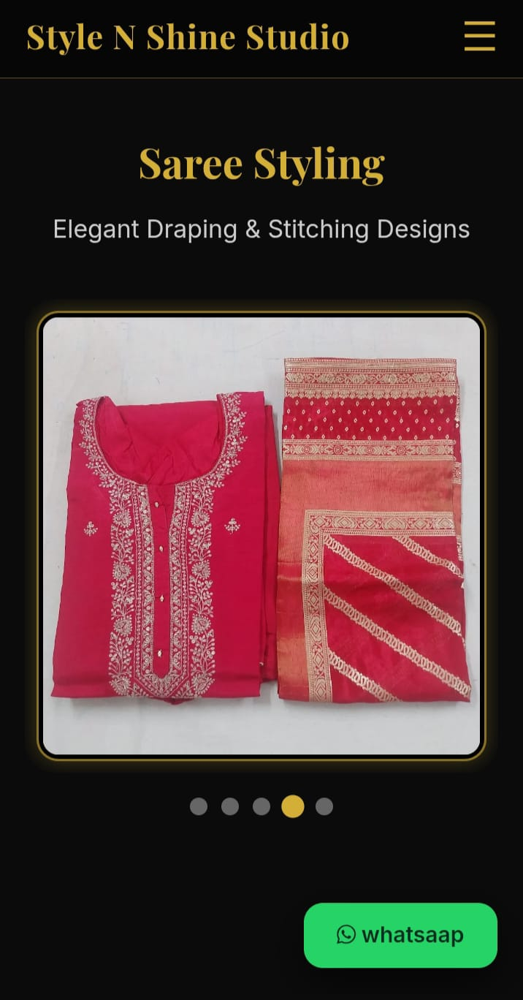

# 💇‍♂️ Style N Shine Salon | Studio & Management System


A premium digital solution for **Style N Shine Studio**. This project features a high-conversion landing page for customers and a secure **PHP/MySQL backend** for salon billing and operations.

---

## 📸 Project Showcase

### 🖥️ Desktop Interface
Five detailed views of the main landing page and admin dashboard.

| **1. Hero Section** | **2. About Us Section Menu** | **3. Our Services Section** |
| :--- | :--- | :--- |
|  |  |  |

| **4. Bokking Dashboard** | **5. Customer Reveiws** |**6. Contact us**

|  |  |

---

### 📱 Mobile Experience
Our website is fully optimized for seamless browsing on all smartphone devices.

<p align="center">
  
  &nbsp;&nbsp;&nbsp;&nbsp;
  
   &nbsp;&nbsp;&nbsp;&nbsp;
  
</p>

---

## 🛠️ Technological Stack

| Layer | Technology | Key Usage |
| :--- | :--- | :--- |
| **Frontend** | HTML5 & CSS3 | Custom gold/dark luxury theme & Flexbox layout. |
| **Backend** | PHP (MySQLi) | Secure server-side logic and session management. |
| **Database** | MySQL | Relational data storage for services and invoices. |
| **Interactivity** | JavaScript (ES6) | Real-time calculations and WhatsApp image rendering. |

---

## 📖 About This Project

**Style N Shine** was developed to bridge the gap between premium physical styling and a digital brand.

* **For Customers:** Offers a beautiful gallery of services and **one-tap booking** via WhatsApp.


---

## 📦 Installation & Database Setup

1.  **Clone the Repository:**
    ```bash
    git clone https://github.com/Vibhav11Krishna/style-n-shine-website.git
    ```
2.  **Import Database:**
    * Create a database named `salon_billing` in phpMyAdmin.
    * Import the `database.sql` file provided in the root folder.
3.  **Config:**
    * Update `config.php` with your database credentials.

---

## 🌐 Live Preview
Visit the live studio here:  
👉 **[Style N Shine Official Site](https://style-n-shine.great-site.net/?i=1)**

---

**Developed with ❤️ for Style N Shine Studio.**
